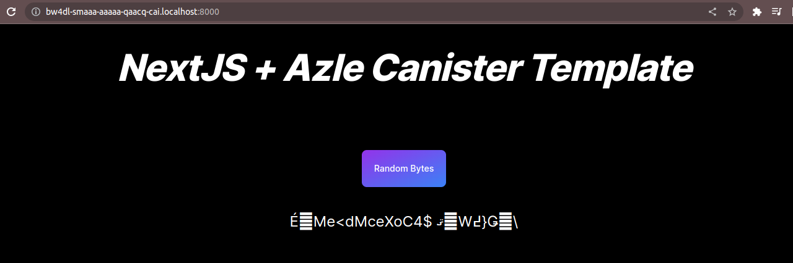

# IC Dapp Template

## Prerequisites

- dfx > 0.15.0-ext.0
- Nodejs >= 18.16.0
- yarn
- jq (Command line based JSON processor).
- To install jq run:

    `sudo apt update && sudo apt install -y jq`

Follwing are the steps to deploy your application locally

1. Install wsl:

    `wsl --install`

2. Install dfx:

   `DFX_VERSION=0.15.0 sh -ci "$(curl -fsSL https://sdk.dfinity.org/install.sh)"`

3. Add dfx to your path

   `echo 'export PATH="$PATH:$HOME/bin"' >> "$HOME/.bashrc"`

4. Install nvm

   ```curl -o- https://raw.githubusercontent.com/nvm-sh/nvm/v0.39.3/install.sh | bash```
   `nvm use 18`

5. Install dependencies:

    `yarn && cd azle/ && yarn && cd ..`

6. Run below commands:

   ```dfx start --clean --background```

   `bash scripts/deploy_frontend_canister.sh  local`

7. Install nvm

   ```curl -o- https://raw.githubusercontent.com/nvm-sh/nvm/v0.39.3/install.sh | bash```
   `nvm use 18`

- To Stop Replica run:

   ```dfx stop```

   
